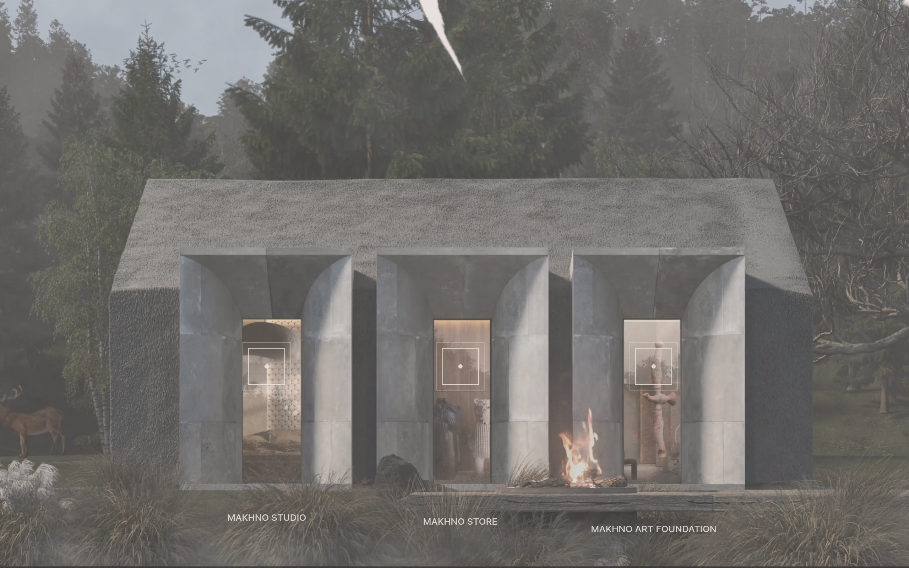

# makhno-reference DESIGN.md

> Auto-generated design system — reverse-engineered via static analysis by skillui.
> Frameworks: None detected
> Colors: 20 · Fonts: 2 · Components: 7
> Icon library: not detected · State: not detected
> Primary theme: light · Dark mode toggle: no · Motion: expressive

## Visual Reference

**Match this design exactly** — study colors, fonts, spacing, and component shapes before writing any UI code.



---

## 1. Visual Theme & Atmosphere

This is a **light-themed** interface with a warm, approachable feel. The light background emphasizes content clarity. Typography pairs **Inter** for display/headings with **swiper-icons** for body text, creating clear visual hierarchy through type contrast. Spacing follows a **8px base grid** (standard density), with scale: 4, 8, 16, 20, 24, 32, 40, 48px. The accent color **#ff6900** anchors interactive elements (buttons, links, focus rings). Motion is expressive — spring physics, layout animations, and staggered reveals are part of the visual language.

---

## 2. Color Palette & Roles

| Token | Hex | Role | Use |
|---|---|---|---|
| theme-color | `#ffffff` | background | Page background, darkest surface |
| surface | `#ece4e1` | surface | Card and panel backgrounds |
| wp--preset--color--black | `#000000` | text-primary | Headings and body text |
| text-muted | `#7c7976` | text-muted | Captions, placeholders, secondary info |
| border | `#353535` | border | Dividers, card borders, outlines |
| wp--preset--color--luminous-vivid-orange | `#ff6900` | accent | CTAs, links, focus rings, active states |
| danger | `#dc4343` | danger | Error states, destructive actions |
| wp--preset--color--light-green-cyan | `#7bdcb5` | success | Success states, positive indicators |
| wp--preset--color--luminous-vivid-amber | `#fcb900` | warning | Warning states, caution indicators |
| swiper-theme-color | `#007aff` | info | Informational highlights |
| unknown | `#988d83` | unknown | Palette color |
| unknown | `#afa49a` | unknown | Palette color |
| unknown | `#2e2721` | unknown | Palette color |
| tile-color | `#da532c` | unknown | Palette color |
| wp--preset--color--cyan-bluish-gray | `#abb8c3` | unknown | Palette color |
| wp--preset--color--pale-pink | `#f78da7` | unknown | Palette color |
| wp--preset--color--vivid-red | `#cf2e2e` | unknown | Palette color |
| wp--preset--color--vivid-green-cyan | `#00d084` | unknown | Palette color |
| wp--preset--color--pale-cyan-blue | `#8ed1fc` | unknown | Palette color |
| wp--preset--color--vivid-cyan-blue | `#0693e3` | unknown | Palette color |

### CSS Variable Tokens

```css
--accent: $color-pearl-bush;
--background: $color-mine-shaft;
--accent: $color-pearl-bush;
--background: $color-mine-shaft;
--accent: $color-pearl-bush;
--background: $color-mine-shaft;
--accent: $color-pearl-bush;
--background: $color-mine-shaft;
--accent: $color-pearl-bush;
--background: $color-mine-shaft;
```


---

## 3. Typography Rules

**Font Stack:**
- **swiper-icons** — Heading 1, Heading 2, Heading 3
- **Inter** — Body, Caption

**Font Sources:**

```css
@font-face {
  font-family: "Inter";
  src: url("fonts/Inter-Bold.ttf") format("truetype");
  font-weight: 700;
}
@font-face {
  font-family: "Inter";
  src: url("fonts/Inter-Regular.ttf") format("truetype");
  font-weight: 400;
}
@font-face {
  font-family: "swiper-icons";
  src: url("data:application/font-woff;charset=utf-8;base64, d09GRgABAAAAAAZgABAAAAAADAAAAAAAAAAAAAAAAAAAAAAAAAAAAAAAAABGRlRNAAAGRAAAABoAAAAci6qHkUdERUYAAAWgAAAAIwAAACQAYABXR1BPUwAABhQAAAAuAAAANuAY7+xHU1VCAAAFxAAAAFAAAABm2fPczU9TLzIAAAHcAAAASgAAAGBP9V5RY21hcAAAAkQAAACIAAABYt6F0cBjdnQgAAACzAAAAAQAAAAEABEBRGdhc3AAAAWYAAAACAAAAAj//wADZ2x5ZgAAAywAAADMAAAD2MHtryVoZWFkAAABbAAAADAAAAA2E2+eoWhoZWEAAAGcAAAAHwAAACQC9gDzaG10eAAAAigAAAAZAAAArgJkABFsb2NhAAAC0AAAAFoAAABaFQAUGG1heHAAAAG8AAAAHwAAACAAcABAbmFtZQAAA/gAAAE5AAACXvFdBwlwb3N0AAAFNAAAAGIAAACE5s74hXjaY2BkYGAAYpf5Hu/j+W2+MnAzMYDAzaX6QjD6/4//Bxj5GA8AuRwMYGkAPywL13jaY2BkYGA88P8Agx4j+/8fQDYfA1AEBWgDAIB2BOoAeNpjYGRgYNBh4GdgYgABEMnIABJzYNADCQAACWgAsQB42mNgYfzCOIGBlYGB0YcxjYGBwR1Kf2WQZGhhYGBiYGVmgAFGBiQQkOaawtDAoMBQxXjg/wEGPcYDDA4wNUA2CCgwsAAAO4EL6gAAeNpj2M0gyAACqxgGNWBkZ2D4/wMA+xkDdgAAAHjaY2BgYGaAYBkGRgYQiAHyGMF8FgYHIM3DwMHABGQrMOgyWDLEM1T9/w8UBfEMgLzE////P/5//f/V/xv+r4eaAAeMbAxwIUYmIMHEgKYAYjUcsDAwsLKxc3BycfPw8jEQA/gZBASFhEVExcQlJKWkZWTl5BUUlZRVVNXUNTQZBgMAAMR+E+gAEQFEAAAAKgAqACoANAA+AEgAUgBcAGYAcAB6AIQAjgCYAKIArAC2AMAAygDUAN4A6ADyAPwBBgEQARoBJAEuATgBQgFMAVYBYAFqAXQBfgGIAZIBnAGmAbIBzgHsAAB42u2NMQ6CUAyGW568x9AneYYgm4MJbhKFaExIOAVX8ApewSt4Bic4AfeAid3VOBixDxfPYEza5O+Xfi04YADggiUIULCuEJK8VhO4bSvpdnktHI5QCYtdi2sl8ZnXaHlqUrNKzdKcT8cjlq+rwZSvIVczNiezsfnP/uznmfPFBNODM2K7MTQ45YEAZqGP81AmGGcF3iPqOop0r1SPTaTbVkfUe4HXj97wYE+yNwWYxwWu4v1ugWHgo3S1XdZEVqWM7ET0cfnLGxWfkgR42o2PvWrDMBSFj/IHLaF0zKjRgdiVMwScNRAoWUoH78Y2icB/yIY09An6AH2Bdu/UB+yxopYshQiEvnvu0dURgDt8QeC8PDw7Fpji3fEA4z/PEJ6YOB5hKh4dj3EvXhxPqH/SKUY3rJ7srZ4FZnh1PMAtPhwP6fl2PMJMPDgeQ4rY8YT6Gzao0eAEA409DuggmTnFnOcSCiEiLMgxCiTI6Cq5DZUd3Qmp10vO0LaLTd2cjN4fOumlc7lUYbSQcZFkutRG7g6JKZKy0RmdLY680CDnEJ+UMkpFFe1RN7nxdVpXrC4aTtnaurOnYercZg2YVmLN/d/gczfEimrE/fs/bOuq29Zmn8tloORaXgZgGa78yO9/cnXm2BpaGvq25Dv9S4E9+5SIc9PqupJKhYFSSl47+Qcr1mYNAAAAeNptw0cKwkAAAMDZJA8Q7OUJvkLsPfZ6zFVERPy8qHh2YER+3i/BP83vIBLLySsoKimrqKqpa2hp6+jq6RsYGhmbmJqZSy0sraxtbO3sHRydnEMU4uR6yx7JJXveP7WrDycAAAAAAAH//wACeNpjYGRgYOABYhkgZgJCZgZNBkYGLQZtIJsFLMYAAAw3ALgAeNolizEKgDAQBCchRbC2sFER0YD6qVQiBCv/H9ezGI6Z5XBAw8CBK/m5iQQVauVbXLnOrMZv2oLdKFa8Pjuru2hJzGabmOSLzNMzvutpB3N42mNgZGBg4GKQYzBhYMxJLMlj4GBgAYow/P/PAJJhLM6sSoWKfWCAAwDAjgbRAAB42mNgYGBkAIIbCZo5IPrmUn0hGA0AO8EFTQAA") format("woff");
  font-weight: 400;
}
```

| Role | Font | Size | Weight |
|---|---|---|---|
| Heading 1 | swiper-icons | 5rem | 700 |
| Heading 2 | swiper-icons | 4rem | 700 |
| Heading 3 | swiper-icons | 3.4rem | 700 |
| Body | Inter | 1.3rem | 400 |
| Caption | Inter | 1.4rem | 400 |

**Typographic Rules:**
- Limit to 2 font families max per screen
- Use **swiper-icons** for body/UI text, **Inter** for display/headings
- Maintain consistent hierarchy: no more than 3-4 font sizes per screen
- Headings use bold (600-700), body uses regular (400)
- Line height: 1.5 for body text, 1.2 for headings
- Use color and opacity for secondary hierarchy, not additional font sizes


---

## 4. Component Stylings

### Layout (1)

**Footer** — `html`

### Navigation (1)

**Navigation** — `html`

### Data Display (1)

**List** — `html`

### Data Input (2)

**Button** — `html`
- Animation: 

**Input** — `html`
- State: :focus, :placeholder

### Media (2)

**Image** — `html`

**Icon** — `html`


---

## 5. Layout Principles

- **Base spacing unit:** 8px
- **Spacing scale:** 4, 8, 16, 20, 24, 32, 40, 48, 56, 64, 72, 80
- **Border radius:** .2rem, .3rem, 1rem, 8%, 10px, 10em
- **Max content width:** 1023px

**Spacing as Meaning:**
| Spacing | Use |
|---|---|
| 4-8px | Tight: related items within a group |
| 16px | Medium: between groups |
| 24-32px | Wide: between sections |
| 48px+ | Vast: major section breaks |


---

## 6. Depth & Elevation

### Flat — subtle depth hints

- `inset 0 0 0 2px #353535`

### Raised — cards, buttons, interactive elements

- `inset 0 0 0 .1rem currentColor`

### Z-Index Scale

`1, 2, 3, 4, 6, 7, 8, 9, 10, 100, 999, 1000, 9999999`


---

## 7. Animation & Motion

This project uses **expressive motion**. Animations are an integral part of the experience.

### CSS Animations

- `@keyframes title-underline`
- `@keyframes title-underline-reverse`
- `@keyframes crawling-line`
- `@keyframes button-underline`
- `@keyframes button-icon-movement`
- `@keyframes button-icon-movement-reverse`

### Animated Components

- **Button**: 

### Motion Guidelines

- Duration: 150-300ms for micro-interactions, 300-500ms for page transitions
- Easing: `ease-out` for enters, `ease-in` for exits
- Always respect `prefers-reduced-motion`


---

## 8. Do's and Don'ts

### Do's

- Use `#ff6900` for interactive elements (buttons, links, focus rings)
- Use `#ffffff` as the primary page background
- Pair **swiper-icons** (body) with **Inter** (display) — these are the only allowed fonts
- Follow the **8px** spacing grid for all margins, padding, and gaps
- Use the defined shadow tokens for elevation — see Section 6
- Use border-radius from the scale: .2rem, .3rem, 1rem, 8%, 10px
- Reuse existing components from Section 4 before creating new ones

### Don'ts

- Don't introduce colors outside this palette — extend the design tokens first
- Don't introduce additional font families beyond swiper-icons and Inter
- Don't use arbitrary spacing values — stick to multiples of 8px
- Don't create custom box-shadow values outside the system tokens
- Don't use arbitrary border-radius values — pick from the defined scale
- Don't duplicate component patterns — check Section 4 first
- Don't use backdrop-blur or blur effects

### Anti-Patterns (detected from codebase)

- No blur or backdrop-blur effects
- No zebra striping on tables/lists


---

## 9. Responsive Behavior

| Name | Value | Source |
|---|---|---|
| sm | 520px | css |
| md | 767px | css |
| md | 768px | css |
| lg | 1023px | css |
| lg | 1024px | css |
| xl | 1279px | css |
| xl | 1280px | css |
| 2xl | 1440px | css |
| 2xl | 1920px | css |

**Approach:** Use `@media (min-width: ...)` queries matching the breakpoints above.


---

## 10. Agent Prompt Guide

Use these as starting points when building new UI:

### Build a Card

```
Background: #ece4e1
Border: 1px solid #353535
Radius: 8%
Padding: 32px
Font: swiper-icons
Use shadow tokens from Section 6.
```

### Build a Button

```
Primary: bg #ff6900, text white
Ghost: bg transparent, border #353535
Padding: 16px 32px
Radius: 8%
Hover: opacity 0.9 or lighter shade
Focus: ring with #ff6900
```

### Build a Page Layout

```
Background: #ffffff
Max-width: 1023px, centered
Grid: 8px base
Responsive: mobile-first, breakpoints from Section 9
```

### Build a Stats Card

```
Surface: #ece4e1
Label: #7c7976 (muted, 12px, uppercase)
Value: #000000 (primary, 24-32px, bold)
Status: use success/warning/danger from Section 2
```

### Build a Form

```
Input bg: #ffffff
Input border: 1px solid #353535
Focus: border-color #ff6900
Label: #7c7976 12px
Spacing: 32px between fields
Radius: 8%
```

### General Component

```
1. Read DESIGN.md Sections 2-6 for tokens
2. Colors: only from palette
3. Font: swiper-icons, type scale from Section 3
4. Spacing: 8px grid
5. Components: match patterns from Section 4
6. Elevation: shadow tokens
```
